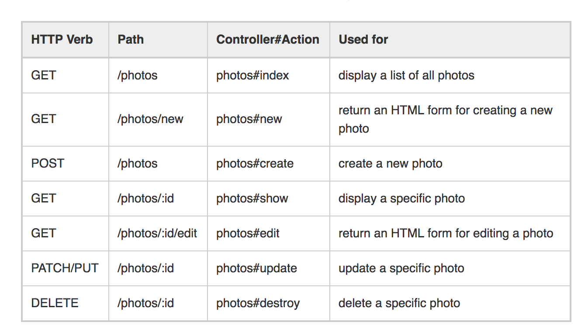

# 7 RESTful Routes Boilerplate

### 'get'
* A method to retrieve data from a server at any specified resource
* It will only make request for data and 'get' it back to the endpoint, it can't modify, or make changes to anything

### 'post'
* Send data to the server to create a new resource of information
* Calling 'post' repeatedly will create multiple resources as it is not idempotent; it will see it as if the user wants to keep changing and adding in more new resources
* The data sent will get stored in the request body of the HTML

### 'put'
* Send data over to the server once it's been changed/updated
* Calling 'put' multiple times won't create another resource; it's idempotent
* A specific resource will get called, and user will be able to edit all the details through the HTML output

### 'patch'
* Similar to 'put'
* Used when you want to partially modify the resource

### 'delete'
* Remove a resource at that specified URL
